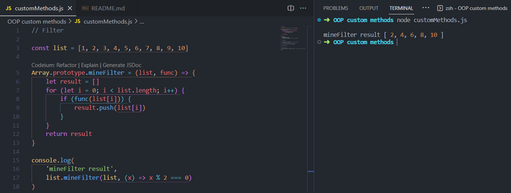
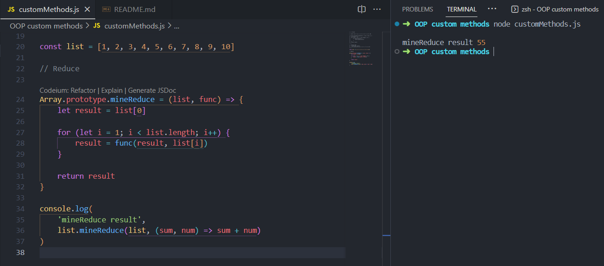

# OOP Custom Methods

Implementations made using the Array.prototype method and loops. Using the callback functions returned to the function, we can easily replicate the original .filter() and .reduce() methods.

## mineFilter()

## mineReduce()

